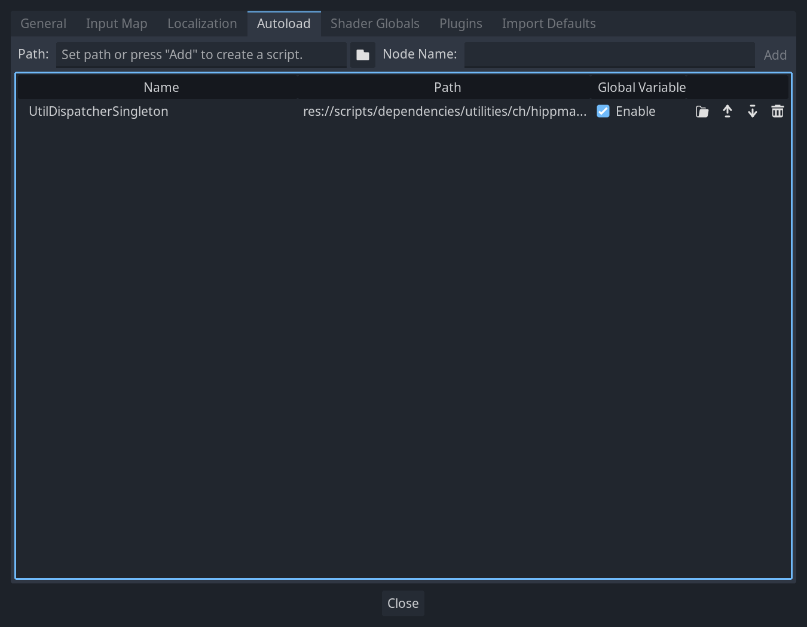

# Godot Kotlin Jvm utilities
This is a small library providing common utilities which might be useful in many [godot kotlin jvm](https://github.com/utopia-rise/godot-kotlin-jvm) projects.

> **Note:** this library is basically just a collection of little things i wrote over and over in small projects and now just extracted into this common library. Consider it untested and inefficient! Feel free to use and improve it. PR's are very welcome.

## Adding to your project
Add the library as a dependency to your project. As it is published to maven central, you should also make sure that you have maven central set up as a repository:
```kotlin
repositories {
    mavenCentral()
}

dependencies {
    implementation("ch.hippmann.godot:utilities:<version>")

    // if you plan on using the coroutine helpers; don't forget to add the kotlinx coroutines dependency:
    implementation("org.jetbrains.kotlinx:kotlinx-coroutines-core:<version>")
}
```

## Utilities and their usage
### Autoload
Just a little shorthand to access your autoload singletons:
```kotlin
val autoloadInstance = autoload<YourAutoloadClass>() // unsafe -> throws an error if the autoload is not present or not of expected type
val autoloadInstanceNullable = autoloadSafe<YourAutoloadClass>() // safe -> returns null if the autoload is not present or not of expected type

val autoloadInstanceNamed = autoload<YourAutoloadClass>("CustomNameYouSetInTheEditor") // provide a custom node name you set in the godot project settings when you added the autoload singleton
val autoloadInstanceNullableNamed = autoloadSafe<YourAutoloadClass>("CustomNameYouSetInTheEditor") // provide a custom node name you set in the godot project settings when you added the autoload singleton
```

### Logging
Logging abstraction to print logs more concisely:
```kotlin
val someException: Throwable = fromSomewhere

// Prints:
// DEBUG: A log message explaining why an exception occurred 
// stacktrace printed
debug(someException) {
    "A log message explaining why an exception occurred"
}

// Prints:
// DEBUG: A log message explaining why an exception occurred 
// stacktrace printed
debug(someException, "A log message explaining why an exception occurred")

// Prints:
// DEBUG: Just a log message
debug {
    "Just a log message"
}

// Prints:
// DEBUG: Just a log message
debug("Just a log message")
```

The above examples are present with the following severities:
- debug
- info
- warn
- err

### Coroutine dispatchers
Mainly provides a `Dispatchers.Main` and abstracts all dispatcher usage so they are accessed the same:

This library provides an autoload singleton you need to add to your project (remember to have it higher in the order if you use dispatchers in your own autoload singletons, so it's initialised before your autoloads!). You can find the registration file (`gdj`) in the `dependencies` directory in the `gdj` output directory of your project after you've built your project.


You can access the dispatchers like so:
```kotlin
val mainDispatcher = mainDispatcher()
val ioDispatcher = ioDispatcher()
val defaultDispatcher = defaultDispatcher()

// example usage in `launch`:
launch(mainDispatcher()) {
    // your code running on the main thread
}
```

### Godot coroutine scope
Allows you to launch kotlin coroutines from within a node. In the case of ui nodes, it also provides you the means to run continuations in the context of the ui (you can freely choose where, by calling `resumeUiContinuations`).

**Note:** It is very important that if you use `withUiContext` you also have a `resumeUiContinuations` call in your node! Otherwise all coroutines which use `withUiContext` will block indefinitely and cause memory leaks for good measure! 

```kotlin
@RegisterClass
class TestNode : Control(), GodotCoroutineScope by DefaultGodotCoroutineScope() {
  // by default, runs coroutines on the dispatcher `Dispatchers.Default` with a `SupervisorJob`. Errors in coroutines are propagated by throwing
  // you can however override the scope if you  want (this example is the actual default implementation):
  // OPTIONAL BLOCK: START
  override val coroutineContext: CoroutineContext =
    defaultDispatcher() + SupervisorJob() + object : CoroutineExceptionHandler {
      override val key: CoroutineContext.Key<*> = CoroutineExceptionHandler
      override fun handleException(context: CoroutineContext, exception: Throwable) {
        throw exception
      }
    }
  // OPTIONAL BLOCK: END

  @Export
  @RegisterProperty
  lateinit var label: Label

  @Export
  @RegisterProperty
  lateinit var button: Button

  @RegisterFunction
  override fun _ready() {
    button.pressed.connect(this, TestNode::onButtonPressed)
  }

  @RegisterFunction
  override fun _process(delta: Double) {
    resumeUiContinuations() // this resumes any continuations started with `withUiContext`. You can place it anywhere you want to. It basically runs all pending blocks of `withUiContext` synchronously in the order they were added
  }

  @RegisterFunction
  fun onButtonPressed() {
    launch {
      // using default dispatcher defined by DefaultGodotCoroutineScope
      // do some work
      println("BACKGROUND: Executing work on background dispatcher")

      delay(100)
      val resultOfWork = "result of work"

      withUiContext { 
        // the code here runs the next time you call `resumeUiContinuations`. Which in this example, is the next time `_process` is called
        println("UICONTEXT: Setting label")
        label.text = resultOfWork
      }
      delay(100)
      println("BACKGROUND: Executing more work on background dispatcher")
    }
  }
}
```

### Await signals
Allows you to await signal emitions inside coroutines.

**Note:** Necessitates the setup of [Coroutine dispatchers](#coroutine-dispatchers) and implicitly applies [GodotCoroutineScope](#godot-coroutine-scope)!

You must call `initSignalAwait` before any call to godot lifecycle function (like `_enterTree`) is performed and before any call to the `await` function!

Example:
```kotlin
@RegisterClass
class SignalAwaitSample: Node(), SignalAwaitable by SignalAwaiter() {
    init {
        // needs to be called before any godot lifecycle function like `_enterTree` is called!
        initSignalAwait()
    }

    @RegisterFunction
    override fun _enterTree() {
        launch {
            GD.print("Before await for ${::ready.name} signal")
            ready.await()
            GD.print("Node appears to be ready according to signal await")
        }
        runBlocking { delay(1.seconds) } // to give background thread some time to run in this over simplified example
    }

    @RegisterFunction
    override fun _ready() {
        GD.print("Node is ready! Any signal await messages should appear after this line!")
    }
}
```
